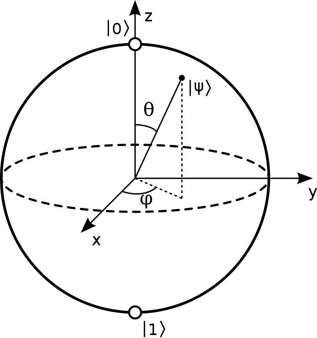

Here’s the thing about Quantum Computing: it is one of the most
interesting and promising fields of research, but at the same time one
of the most obscure. The idea of building a computer using the sometimes
counter-intuitive laws of quantum mechanics is quite old, and since the
80s people are developing a quantum computation theory. One of the first
reasons why this could be relevant is the inherent difficulty of
simulating quantum systems on classical computers (as pointed out by
Feynman himself in $$1982$$). Secondly, a computer built using the rules
of quantum mechanics can, in theory, solve a particular set of problems
way faster than a standard computer. For example, it could search an
element in a generic vector in $$O(\sqrt{n})$$!

Quantum computers are not only theoretical devices, they actually exist
and have been built by companies in the quest of developing this new and
completely different technology. Demonstrating that a quantum computer
can solve a problem more efficiently than a standard computer, however,
is a no easy task, this is the so called quantum supremacy problem. In a
paper from 2019, Google announced that it had achieved for the first
time quantum supremacy. Since then, papers were published showing how
the results claimed by Google were beaten using new techniques to
simulate quantum computers on standard supercomputers. Competition is
fierce and the quest to find quantum algorithms able to outperform
standard computers is still on.

In this article we are going to introduce the basis of quantum computing
theory, with some examples and a little bit of math. The article is
meant for people with a general knowledge of linear algebra and computer
science, but zero knowledge of quantum physics. Oftentimes, introductory
explanations on quantum computing are either too basic, using
simplifying metaphors that don’t really correspond to how things
actually work, or too advanced, cluttering the reader with a
mathematical overhead that is not really required to understand and use
these concepts, at least at first. Our purpose is to bridge the divide
between these two explanations, giving you a clear picture of these
abstract concepts while reducing the math to an accessible amount.

## The Qubit

Let’s start with the basics. In classical theory of computation, the
basic element is the bit, it’s a simple object that can assume either
value $$0$$ or $$1$$. Well, in quantum we have an analogous: the quantum bit
or qubit for short. Just as the standard bit has two states: $$0$$ and $$1$$
a qubit can have two states: $$\ket{0}$$ and $$\ket{1}$$. We represent these
simple states with 2-element vectors. The weird $$\ket{\cdot}$$ notation
is a short way of representing a vector and is called the *Dirac* notation. Our
base states are thus:

$$
    \ket{0} = \begin{bmatrix} 1 \\ 0 \end{bmatrix}\;\; 
    \ket{1} = \begin{bmatrix} 0 \\ 1 \end{bmatrix}
$$

The thingy about qubits is that they can be in states other than
$$\ket{0}$$ or $$\ket{1}$$. In fact, they can be in *any* linear combinations of
these states, also known as *superpositions*:

$$
    \ket{\psi} = \alpha\ket{0} + \beta\ket{1} = 
    \alpha\begin{bmatrix} 1 \\ 0 \end{bmatrix} + \beta\begin{bmatrix} 0 \\ 1 \end{bmatrix} = \begin{bmatrix} \alpha \\ \beta \end{bmatrix}
$$

where $$\alpha$$ and $$\beta$$ are two complex numbers. For now you can
think of them as real numbers, you’ll see that not much is lost. In math
terms, you can see a qubit as a vector in a $$2$$-D space, where the
special states $$\ket{0}$$ and $$\ket{1}$$ are the so called computational
basis states.

Pretty easy until now, right? Well it turns out that qubit have another
relevant difference with their classical counterpart. When reading the
value of a bit this can be in just two states: either $$0$$ or $$1$$. When
we try to read a qubit (also called *measurement*) we find that we *can not* retrieve directly
its values $$\alpha$$ and $$\beta$$, also in this case we only get either a
$$0$$ or $$1$$. So where is the difference? While classical bits always
exist in some definite state, qubits in superposition exist in multiple
states *at the same time*. This is counter-intuitive and pretty far from what we observe
in our daily lives. This does not mean that qubits are secretly in some
state we don’t know until we take a look. This is an inherent property
of nature: some things are not defined until they are measured. If we
were to repeat a measurement multiple times we would observe that
sometimes we land on $$0$$ and sometimes we land on $$1$$, with
probabilities $$|\alpha|^2$$ and $$|\beta|^2$$ respectively. A qubit can be seen as a “list” of probabilities of its outcomes (more properly called *distribution*). Since probabilities sum to $$1$$, we find that for all qubits:

$$
|\alpha|^2+|\beta|^2=1
$$

For example let’s consider the following qubits:

$$
    \ket{A} = 
        \begin{bmatrix} 
            \frac{1}{\sqrt{2}} \\[5pt]
            -\frac{1}{\sqrt{2}} 
        \end{bmatrix}
    \longrightarrow \Big| \frac{1}{\sqrt{2}} \Big|^2 + \Big|-\frac{1}{\sqrt{2}}\Big|^2 = 1
$$

$$
    \ket{B} = 
        \begin{bmatrix}
        1 \\[5pt]
        1 
        \end{bmatrix} 
    \longrightarrow 2 \neq 1
$$

Notice how in the example shown above, $$\ket{A}$$ is a valid qubit, while $$\ket{B}$$ is not, since its values don’t sum to $$1$$. Also observe how values inside state vectors can be negative and still produce valid probabilities (we are taking a squared norm, after all).

Observe also how qubits can encode values that have an infinite number
of decimal digits at no extra cost. If we keep qubits in superposition
we have an infinite precision representation of numbers:

$$
    \ket{A} = 
        \begin{bmatrix} 
            \frac{1}{\sqrt{2}} \\[5pt]
            -\frac{1}{\sqrt{2}} 
        \end{bmatrix} =
        \begin{bmatrix} 
            0.7071... \\[5pt]
            -0.7071... 
        \end{bmatrix}
$$

How great this is! But as soon as we measure a qubit, some part of it is
lost. We go from a potentially infinite amount of information to a
single bit. This means there is a sort of *hidden* information encoded somewhere,
but we can see just a part of it. This information actually exists and
we can perform computations with it (this is the whole point of quantum
computing). In a nutshell, the goal of quantum computing is to find
clever ways to extract this hidden information in the most efficient way
possible.

An useful analogy for understanding the qubit is the Schrödinger’s cat
(if you don’t know about this thought experiment, more info can be found [here](https://en.wikipedia.org/wiki/Schr%C3%B6dinger%27s_cat)). To
recap what the experiment is about: let’s imagine to put a cat, a flask
of poison and a source of radiation in a box. The source of radiation is
an atom in a superposition of $$\ket{decayed}$$ and $$\ket{not\,decayed}$$.
If a Geiger counter detects radioactivity it causes the release of
poison, thus killing the cat. The point is that we don’t know when the
Geiger counter will detect radioactivity (n.d.r. caused by a single atom
decaying). So if we close the box we don’t know if the cat it’s still
alive or dead. We can say that the cat is in a superposition of these
states, being both alive and dead at the same time, like a qubit can
be both $$\ket{0}$$ and $$\ket{1}$$. The point is that, when we eventually
open the box, the cat can not be in a mixture of the two states, it will
be alive or dead, exactly how the qubit, when measured, can just be $$0$$ or $$1$$. Why does this state collapse happens? Nobody knows, but this how
things work, you know.

Back to our math, we said that the values $$|\alpha|^2+|\beta|^2=1$$, so a
qubit can be seen as a unit vector in a two dimensional complex space,
thus we may rewrite the qubit as:

$$
    \ket{\psi}=e^{i\gamma}\left(\cos\frac{\theta}{2}\ket{0}+e^{i\varphi}\sin\frac{\theta}{2}\ket{1}\right)  
$$

with $$\theta$$, $$\varphi$$, $$\gamma$$ real numbers. Actually we can ignore the
factor $$e^{i\gamma}$$ (the reason why is outside the scope of this
article), thus rewriting the qubit as:

$$
    \ket{\psi}=\cos\frac{\theta}{2}\ket{0}+e^{i\varphi}\sin\frac{\theta}{2}\ket{1}
$$

We can see the qubit as a point in the 3-$$D$$ unit sphere, also called
Bloch sphere, this visualization is often used in quantum computing,
even if it can not be generalized to multiple qubit systems.

Figure 1: A Bloch sphere

## Quantum Gates

We have our qubit, the basic quantum computational element, now we
should introduce how to use it. Simple! We can use quantum gates: just
as classical computers have logical gates to manipulate information,
quantum computers have quantum gates. Let’s keep it simple for now and
consider just single bit gates. In classical computation theory the only
interesting single bit gate is the NOT, providing the mapping $$0\to1$$,
$$1\to0$$. There are also three other single bit gates: Identity, Set to
$$0$$ and Set to $$1$$, but they are not that interesting.

Can we imagine an analogous quantum NOT gate? This would be a gate that
inverts the state $$\ket{0}$$ to $$\ket{1}$$ and vice versa. The problem
here is that specifying an action on the states $$\ket{0}$$ and $$\ket{1}$$
does not tell anything about what happens to the superposition of these
two states. The quantum NOT on the other hand acts linearly, this means
that it takes a qubit in the state:

$$
\ket{\psi} = \alpha\ket{0} + \beta\ket{1}
$$ 

and outputs the qubit:

$$
\ket{\psi} = \beta\ket{0} + \alpha\ket{1}
$$

Actually all quantum gates, not just the NOT, act in a linear fashion.
This is a general property of quantum operators. Since a quantum gate
acts linearly, we can represent it in a matrix form. For example, here
is the quantum NOT we described earlier:

$$
    X = \begin{bmatrix}
0 & 1\\
1 & 0
\end{bmatrix}
$$

This is how the gate operates in matricial form:

$$
    X\begin{bmatrix}\alpha \\ \beta\end{bmatrix}
    =
    \begin{bmatrix}
0 & 1\\
1 & 0
\end{bmatrix}
\begin{bmatrix}\alpha \\ \beta\end{bmatrix}
=
\begin{bmatrix}\beta \\ \alpha\end{bmatrix}
$$

That’s quite interesting: we can describe quantum gates by matrices, but
what are the property that these matrices should have? Well, for every
qubit with parameters $$\alpha$$ and $$\beta$$ we have the constraint
$$|\alpha|^2+|\beta|^2=1$$, this means that if we let our valid qubit go
through a quantum gate then we want a valid qubit on the way out, with
squared values that sum to 1. With a little bit of linear algebra it is
possible to show that for a matrix $$U$$ to be a valid quantum gate it
should have the property: $$U^{\dagger}U=I$$. $$U^{\dagger}$$ is the *adjoint*
matrix of $$U$$ (also called *Hermitian transpose*), obtained by taking the transpose of $$U$$ and complex
conjugating it. This constraint is called Hermiticity, and any matrix
that satisfy it is a valid quantum gate! This means that there many
non-trivial single bit quantum gates.

For example a very important gate is the Hadamard gate:

$$
    H = \frac{1}{\sqrt{2}}\begin{bmatrix}
    1 & 1 \\
    1 & -1
    \end{bmatrix}
$$

This gate sends states in superposition. Observe below how, by feeding
it a base state $$\ket{0}$$ or $$\ket{1}$$, we are left with a superposition
with a $$50\%$$ chance of landing on $$0$$ and a $$50\%$$ chance of landing on
$$1$$.

$$
    H\begin{bmatrix}1 \\ 0\end{bmatrix}
    =
    \begin{bmatrix}\frac{1}{\sqrt{2}} \\[5pt] \frac{1}{\sqrt{2}}\end{bmatrix}
$$

$$
    H\begin{bmatrix}0 \\ 1\end{bmatrix}
    =
    \begin{bmatrix}\frac{1}{\sqrt{2}} \\[5pt] -\frac{1}{\sqrt{2}}\end{bmatrix}
$$

$$
    \Big| \frac{1}{\sqrt{2}} \Big|^2 = 
    \Big|-\frac{1}{\sqrt{2}}\Big|^2 = 0.5    
$$

A natural question to ask is: why the $$-1$$ in the bottom right corner of
the matrix? This is because an important property of quantum gates
(derived from the Hermiticity constraint) is that all gates should be
reversible, i.e. if we let go to the same gate the output qubit we will
end up with the original one. This is actually an important property of
quantum phisics that emerges in multiple situations.

## Conclusions

In this introductory article we gave you a taste of quantum computing
and we introduced some fundamental concepts and notation. Probably
you’ll be quite confused at this point. Don’t worry, it’s normal.
Quantum computing is hard to grasp at first, but if you decide to delve
deeper into it, things will make more and more sense. There are many
reasons for doing so: one can be personal interest, another can be the
fact that investing time in learning these concepts can be very
strategic. Many large companies have invested millions into this field,
and breakthroughs happen by the day. Whatever your reason, if you want
to go deeper we published on our blog a part $$2$$ of this article. Here
we kept the math simple and intuitive, while in part $$2$$ we focus more
on the math formalism and introduce some other important concepts. Don’t
be scared: if you have a general knowledge of computer science and
linear algebra you’ll be able to follow it!