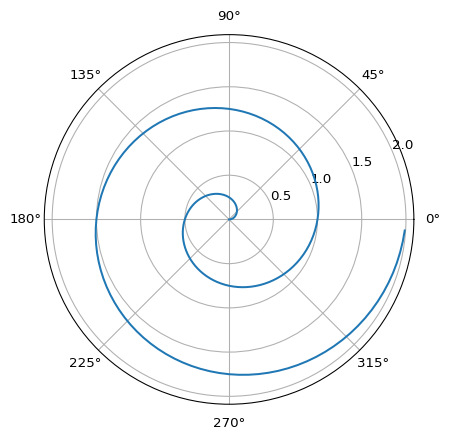

Quarto Basics
================

For a demonstration of a line plot on a polar axis, see
[Figure 1](#fig-polar).

<figure>

<figcaption aria-hidden="true">Figure 1: A line plot on a polar
axis</figcaption>
</figure>

This is a qubit: $$\ket{0}$$

$$
    \ket{0} = \begin{bmatrix} 1 \\ 0 \end{bmatrix}\; 
    \ket{1} = \begin{bmatrix} 0 \\ 1 \end{bmatrix}
$$